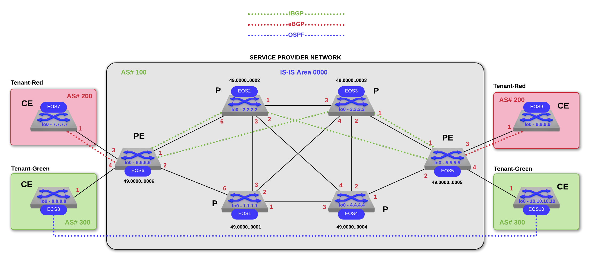

### Summary
Using EVE-NG, build a simulated Service Provider Network and provide L3VPN and L2 Pseudowire Service to separate Tenants (Red and Green).  vEOS nodes 1-10 are connected via the topology below.

vEOS-Lab version:  4.22.3.1M (nodes EOS1-4,7-10)

vEOS-Lab version:  4.24.2.1F (nodes EOS5-6 PEs) - needed for vpws mpls feature

